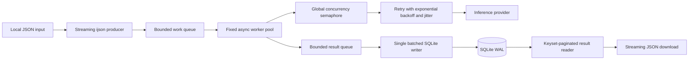

# Batch Inference Engine Architecture

## Request lifecycle

1. `POST /job` validates the local input path and durably inserts a `queued` job.
2. The API returns HTTP 202 immediately with a job ID.
3. Background processing starts independently of the request.
4. `ijson` incrementally reads the top-level JSON array instead of loading the full file.
5. A bounded work queue feeds a fixed-size worker pool.
6. Workers call the inference provider through a shared concurrency limiter and retry layer.
7. Results enter a bounded result queue.
8. A batched writer persists results and job counters to SQLite.
9. `GET /job/{id}/status` reads durable progress counters.
10. `GET /job/{id}/download` streams ordered results from SQLite using keyset pagination.

## Backpressure

The producer uses `await work_queue.put(...)`.

When the bounded queue is full, ingestion automatically waits for workers to create capacity.
This prevents a large input file from creating unbounded in-memory work.

The result path is also bounded. Workers wait if the result queue fills faster than SQLite
can persist results.

## Failure isolation

A provider failure is handled per item whenever possible.

Retryable failures use bounded exponential backoff with jitter. HTTP 429 responses can
honor `Retry-After`.

A persistent failure produces a failed result row after the retry budget is exhausted.
Other prompts continue processing, so one bad element does not drop the rest of the batch.

Authentication failures such as HTTP 401 or 403 are treated as job-level fatal errors.

## Memory behavior at 500,000 items

The design intentionally avoids memory usage proportional to input size.

Memory is approximately bounded by:

`parser batch + work queue + active requests + result queue + writer batch`

Each component has a configured maximum independent of the number of input records.

The implementation does not create one asyncio task per prompt and does not retain all
responses in memory.

The only O(N) state is the SQLite result table on disk.

Download is also bounded because rows are read using keyset pagination and emitted as a
streaming JSON response rather than materializing the complete result set.

## Scaling ceilings

Approximate throughput is bounded by:

`min(worker capacity, concurrency / average provider latency, provider request quota)`

Increasing worker count beyond provider concurrency or provider quota does not improve
throughput.

The current design is intentionally single-process. The concurrency semaphore and provider
admission control are process-local. Horizontal multi-process or multi-host deployment
would require shared queueing, shared persistence, and distributed rate limiting.

## Future extensions

### DigitalOcean Spaces

For stronger durability across machine loss, completed chunks could be uploaded
progressively to DigitalOcean Spaces. A resumable checkpoint could record the last durable
item range so a replacement process can continue without repeating the entire batch.

### Completion webhook

A callback URL could be registered with a job and invoked when the job reaches a terminal
state. Production implementation should validate callback destinations and protect against
SSRF.
